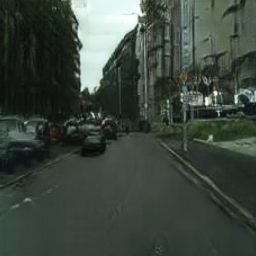

   

# Progressively-trained local-enhanced CycleGAN in PyTorch

This repo is for submitting the final project codes and results of EECS 598 Deep Learning course at University of Michigan, Ann Arbor.

It is forked and adapted from the repo Jun-yan Zhu et al. created for their work on CycleGAN in Pytorch (https://github.com/junyanz/pytorch-CycleGAN-and-pix2pix.git) 
